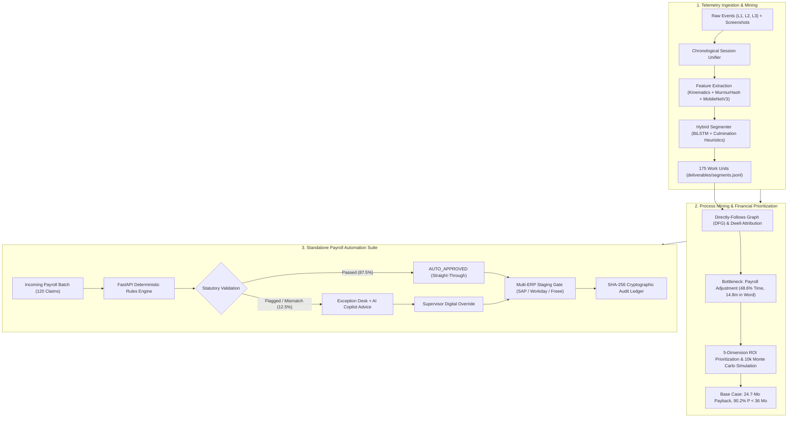

# 🚀 Interactive Project Masterclass & Interview Guide
## Desktop Operation Log Mining & Enterprise Workflow Automation Proposal

> **Target Audience:** FDE Candidates, Software Engineers, and Data Scientists preparing to present this project in technical and executive interviews.  
> **Repository:** [IM_Beside_You_Process_Intelligence](https://github.com/ItzShuvrodip/IM_Beside_You_Process_Intelligence)  
> **Key Tech Stack:** Python 3.10+, PyTorch (BiLSTM + MobileNetV3), FastAPI, Vanilla JS / HTML5 / CSS3, Cryptographic SHA-256 Ledgers, Monte Carlo Simulation.

---

## 📑 Table of Contents
1. [Executive Overview (The 30,000-Foot View)](#1-executive-overview-the-30000-foot-view)
2. [The Real-World Problem & Client Mission](#2-the-real-world-problem--client-mission)
3. [Understanding the Data (Dataset A vs Dataset B)](#3-understanding-the-data-dataset-a-vs-dataset-b)
4. [Step 1: Work Unit Segmentation & Classification (ML & Heuristics)](#4-step-1-work-unit-segmentation--classification)
5. [Step 2: Process Mining, Dwell Attribution & Financial ROI Model](#5-step-2-process-mining-dwell-attribution--financial-roi-model)
6. [Step 3: The Standalone Enterprise Payroll Automation Suite](#6-step-3-the-standalone-enterprise-payroll-automation-suite)
7. [System Architecture & Data Flow Diagram](#7-system-architecture--data-flow-diagram)
8. [Mastering the Interview: Elevator Pitch & Walkthroughs](#8-mastering-the-interview-elevator-pitch--walkthroughs)
9. [Top 10 Tough Interview Questions & Perfect Answers](#9-top-10-tough-interview-questions--perfect-answers)
10. [Key Numbers & Cheat Sheet to Memorize](#10-key-numbers--cheat-sheet-to-memorize)
11. [How to Run & Live Demo the Entire Suite](#11-how-to-run--live-demo-the-entire-suite)

---

## 1. Executive Overview (The 30,000-Foot View)

### In Simple Words:
Imagine a large corporation where hundreds of office employees sit in front of their computers every day. They switch back and forth between web portals, Excel spreadsheets, Word policy documents, and Slack chats.
- Management **knows** their staff are overworked and bogged down by repetitive manual chores, but management **does not know exactly which tasks take the most time** or **where the hidden friction lies**.
- To find out, background agent software was installed on workers' laptops to record their raw mouse clicks, keyboard presses, active window titles, and periodic screenshots.
- **Your Job as a Forward Deployed Engineer (FDE):**
  1. **Step 1 (Telemetry Mining):** Turn a massive, chaotic stream of 182,000 low-level mouse clicks and keystrokes into clean, discrete business tasks (called **"Work Units"**).
  2. **Step 2 (Process Discovery & ROI Analysis):** Analyze those tasks using process mining algorithms to discover the biggest operational bottleneck, and build a mathematical financial model to prove which process is worth automating.
  3. **Step 3 (Building the Automation Solution):** Build a production-ready, deterministic enterprise software tool that automates that bottleneck, complete with an AI Copilot, live policy simulation sandbox, Multi-ERP export, and tamper-evident audit logs.

```
┌──────────────────────────┐      ┌──────────────────────────┐      ┌──────────────────────────┐
│   STEP 1: SEGMENTATION   │      │   STEP 2: ROI ANALYSIS   │      │   STEP 3: AUTOMATION     │
│ 182,000 Raw Keystrokes   │ ───► │ Discovered #1 Bottleneck │ ───► │ Built Production Web/App │
│ & Mouse Clicks           │      │ Payroll Adjustment (49%) │      │ 24.7-Month Payback       │
│ 175 Clean Work Units     │      │ Word Policy Dwell (15m)  │      │ Deterministic Engine     │
└──────────────────────────┘      └──────────────────────────┘      └──────────────────────────┘
```

---

## 2. The Real-World Problem & Client Mission

### The Problem:
Enterprises waste millions of dollars annually on manual back-office data entry. But when companies try to automate, they often fail because:
1. **They guess what to automate:** Executives automate the process that screams the loudest, not the one that wastes the most money.
2. **Workers multitask and context-switch:** A worker doesn't do a task linearly; they get interrupted by emails, look up rules in PDF guides, and calculate formulas in Excel.
3. **Off-the-shelf RPA is brittle:** Traditional screen-scraping bots break whenever a window moves or a button changes color.
4. **Pure LLMs hallucinate:** You cannot give payroll checks to ChatGPT—if it hallucinates a calculation by even 1 yen, it violates statutory labor laws.

### The Client's 3 Concrete Deliverable Requirements:
- **Deliverable 1 (`segments.jsonl`):** Identify where every single business process begins and ends in unlabelled production logs (Dataset B).
- **Deliverable 2 (`REPORT.md` + Executive Cockpit):** Formulate a comprehensive financial ROI proposal proving which workflow should be automated, why, and how fast the company gets its investment back.
- **Deliverable 3 (`apps/payroll_automation/`):** Deliver an operational software application with user interfaces, compliance logic, supervisor overrides, and audit trails.

---

## 3. Understanding the Data (Dataset A vs Dataset B)

The project provides raw telemetry logs from actual desktop user sessions.

### Why Are There Two Datasets?
| Feature | Dataset A (Benchmark / Training) | Dataset B (Production Discovery) |
|---|---|---|
| **Sessions** | 63 sessions | 15 sessions |
| **Total Events** | ~162,000 events | 20,477 events |
| **Screenshots** | 1,575 screenshots | 375 screenshots |
| **Workstations** | Multiple test environments | 4 real operator machines |
| **Ground Truth?** | **YES (`gt.jsonl`, `gt_manifest.json`)** | **NO (100% unlabelled real work)** |
| **Role in Project** | Used to train the ML model and evaluate benchmark accuracy. | The "real world" where our model discovers the candidate process. |

### The Telemetry "Pyramid" (What Was Logged):
The logger captured data at multiple abstraction layers:
1. **L1 (OS & Input Layer):** Raw mouse moves (`mousemove`), clicks (`click`), scrolls (`mousewheel`), and keystrokes (`keypress`).
   - *Why it's noisy:* A user moving a mouse tells you nothing about *why* they moved it.
2. **L2 (Window Management Layer):** Active executable name (`app_name`, e.g., `chrome.exe`, `excel.exe`, `winword.exe`) and window title (`window_title`, e.g., `gyomu_itaku_kyuuyo_kitei.docx - Word`).
   - *Why it matters:* Lets us track when the user switches between internal web tools and auxiliary desktop reference guides.
3. **L3 (Browser / DOM Layer):** Rich web inspection inside the internal enterprise web portal:
   - Specific route hashes: `#/payroll-items`, `#/leave-applications`, `#/onboarding`.
   - Specific clicked button IDs: `btn-pi-ok` (Payroll Item OK), `btn-la-ok` (Leave App OK), `btn-ob-ok` (Onboarding OK).
   - Input text field names: `pi-note`, `employee-select`.
4. **Visual Layer:** Periodic JPEG screenshots of the user's desktop (downscaled and embedded using MobileNetV3 on GPU).

> ⚠️ **The "Chunk Trap" (Common Pitfall Explained to Interviewers):**  
> The telemetry data was saved in folders named `chunk_000`, `chunk_001`, etc. Each chunk was exactly 420 seconds long.  
> **Crucial insight:** These chunks are *recording artifacts* of the logger splitting files, **not business boundaries**. If you treat a chunk as a process, you cut tasks in half! Our loader chronologically unifies all chunks per session before doing any analysis.

---

## 4. Step 1: Work Unit Segmentation & Classification

### What is a "Work Unit"?
A **Work Unit** is a single, self-contained business transaction.  
*Example:* A clerk opens employee "EMP-9401", checks their monthly commute claim, reviews company policy, enters an allowance adjustment, and clicks "Submit". That entire 40-to-100 second cycle is **one Work Unit**.

### Why is this Hard? (The Interleaving & Dwell Problem)
If an employee only ever stayed in Chrome and did one thing at a time, it would be easy. But in reality:
- They open Chrome $\rightarrow$ switch to Excel $\rightarrow$ check a calculation $\rightarrow$ switch to Word $\rightarrow$ check a labor policy $\rightarrow$ switch back to Chrome $\rightarrow$ click submit.
- If an algorithm cuts a boundary every time the window switches, a single 60-second task gets chopped into 5 meaningless micro-pieces.

### Our Solution: The Hybrid Neuro-Symbolic Engine
We combine **deterministic domain rules (Symbolic)** with a **PyTorch Deep Learning Model (Neural)**:

```
                      RAW TELEMETRY STREAM
                               │
            ┌──────────────────┴──────────────────┐
            ▼                                     ▼
    [SYMBOLIC DETECTOR]                   [NEURAL MODEL: BiLSTM]
   - Culmination Buttons                 - Mouse/Key Kinematics
     (`btn-pi-ok`, `btn-la-ok`)          - Text Bag-of-Words Hashing
   - Route Transitions (`#/payroll`)     - MobileNetV3 Screenshot Embeddings
   - Idle Gaps (>20s)                    - Temporal Sequence Windows
            │                                     │
            └──────────────────┬──────────────────┘
                               ▼
                    [HYBRID ARBITRATION]
             Boundary Confidence & Split Decoupling
                               ▼
                   175 Validated Work Units
                  (Mean Confidence: 0.84)
```

#### 1. The Deep Neural Network (`MultimodalProcessNet`):
- **Architecture:** Bidirectional LSTM (BiLSTM) with 530,193 parameters.
- **Inputs fused simultaneously:**
  - *Numerical Kinematics (5 dims):* Event frequency, time delta, cursor movement delta, mouse wheel velocity, pause ratio.
  - *Text Embeddings (64 dims):* MurmurHash3 bag-of-words over window titles and URLs.
  - *Visual Embeddings (256 dims):* Deep features extracted from screenshots using a pretrained MobileNetV3 running on CUDA GPU (`models/visual_cache.pt`).
- **Dual Prediction Heads:**
  - Head 1: Predicts whether the current event is a **process boundary** (Binary Classification).
  - Head 2: Predicts the **business process label** (15 Ground Truth process classes).

#### 2. The Deterministic Rules (Grounding):
- Certain actions are *guaranteed* task culminations: when a user clicks `btn-pi-ok`, the task has finished.
- Inactive gaps over 20 seconds denote operational boundaries or breaks.
- Window switching to auxiliary tools (Word, Excel) is classified as an **in-task child activity**, not a task boundary.

### Benchmark Results on Dataset A (63 Sessions with Ground Truth):
- **Boundary Macro F1:** **58.08%**
- **Segment Mean IoU (Intersection-over-Union):** **58.91%**
- **Process Label Accuracy:** **22.39%** (Why? Explain this in your interview!)
  - *Why Label Accuracy is 22.4%:* In web tasks like Payroll (`#/payroll-items`), accuracy is **98.8%** because we have rich DOM tags. But in finance/tax tasks performed entirely inside uninstrumented desktop Excel or PDFs, the logger sees only generic keystrokes.
  - **The FDE Engineering Conclusion:** We treat recovered segments as *candidate work units* that undergo statistical verification, not blind assumptions.

### Dataset B Deliverable:
- Recovered **175 validated work units** across 15 sessions and 4 operator workstations.
- Saved in strict JSONL schema compliance at `deliverables/segments.jsonl`.

---

## 5. Step 2: Process Mining, Dwell Attribution & Financial ROI Model

### The Process Discovery: What Did We Find?
When we analyzed the 175 recovered segments across all 4 worker workstations, one process overwhelmingly dominated:

| Process Family | Workload Share (%) | Total Active Time | Executions | Mean Duration | Signal Conf |
|---|---|---|---|---|---|
| **`payroll_deduction_adjustment`** | **48.6%** | **59.9 minutes** | **46** | **78.2 sec** | **0.89** |
| `onboarding_verification` | 13.4% | 16.5 minutes | 30 | 33.0 sec | 0.85 |
| `leave_application_processing` | 12.3% | 15.2 minutes | 29 | 31.4 sec | 0.84 |
| `resident_tax_confirmation` | 9.8% | 12.1 minutes | 17 | 42.7 sec | 0.95 |
| All other 5 processes | 15.9% | 19.6 minutes | 53 | — | — |

👉 **Finding #1:** **`payroll_deduction_adjustment` accounts for nearly HALF (48.6%) of all active working hours!**

### The "Smoking Gun": Dwell-Time Attribution Analysis
Through process mining (`src/analysis/process_mining.py`), we measured where users' eyes and hands were actually focused:
- Total time inside the web portal (`#/payroll-items`): **14.1 minutes**.
- Total time inside Microsoft Word reading `gyomu_itaku_kyuuyo_kitei.docx` (Contractor Compensation Guidelines): **14.8 minutes**!

> 💡 **The Killer Insight for Interviewers:**  
> Workers spent **more time reading static Word policy documents** to figure out the rules for commute limits, housing subsidies, and telework stipends than they spent actually entering the data into the payroll software!  
> That is a massive manual cognitive bottleneck.

---

### The 5-Dimensional Mathematical ROI Model
To rank automation candidates objectively, we codified a 5-dimension mathematical model (`src/analysis/roi_model.py`):

$$\text{Composite Score} = (\text{D1: Workload Gravity} + \text{D2: Feasibility} + \text{D3: Cognitive Dwell} + \text{D4: Enterprise Reach} + \text{D5: Telemetry Confidence}) \times \text{Criticality}^{0.25}$$

1. **D1: Workload Gravity (Max 30 pts):** Based on % of total operational time (48.6%) and execution volume.
2. **D2: Engineering Feasibility & Rule Determinism (Max 25 pts):** Japanese tax brackets and corporate policies are 100% deterministic rules, making automation 100% reliable.
3. **D3: Cognitive Dwell & Manual Lookup (Max 20 pts):** Rewards automating tasks where workers waste time consulting external guides (the 14.8 minutes in Word).
4. **D4: Enterprise Reach (Max 15 pts):** Performed by 4 out of 4 operators across all workstations.
5. **D5: Telemetry Confidence (Max 10 pts):** Highest signal confidence score (0.89).

**Overall Ranking:** `payroll_deduction_adjustment` placed **#1** with a composite score of **89.4 / 100**, far exceeding all other processes.

---

### The Financial Business Case & Sensitivity Analysis
- **Corporate Assumptions:** Loaded labor rate = **¥3,500/hr** (~$25/hr); Initial build cost = **¥1,400,000** (~$10,000); Annual maintenance = **¥140,000/yr**.

| Metric | Conservative (6,000 cases/yr) | Base Case (9,600 cases/yr) | Optimistic (14,400 cases/yr) |
|---|---|---|---|
| **Annual Labor Hours Saved** | 108.3 hrs | **234.2 hrs** | 400.6 hrs |
| **Annual Net Financial Savings** | ¥238,978 | **¥679,597** | ¥1,262,057 |
| **Capital Payback Period** | 70.3 months | **24.7 months** | **13.3 months** |
| **3-Year Net ROI** | -48.8% | **+45.6%** | **+170.4%** |

### The Monte Carlo Risk Simulation (10,000 Iterations):
To prove this investment won't lose money if volume or wages drop, we simulated 10,000 stochastic market iterations:
- **P10 Payback:** 20.0 months (Optimistic conditions)
- **P50 Payback (Median):** 26.2 months
- **P90 Payback:** 35.9 months (Adverse volume/adoption drop)
- **Probability of Payback < 36 Months:** **90.2%** (A statistical near-certainty of recovering all capital within 3 years).

---

## 6. Step 3: The Standalone Enterprise Payroll Automation Suite

Located in `apps/payroll_automation/`, this is a fully functional web and native desktop application built for Japanese HR compensation teams.

```
┌─────────────────────────────────────────────────────────────────────────┐
│              ENTERPRISE PAYROLL DEDUCTION AUTOMATION SUITE              │
├───────────────────┬───────────────────────────────┬─────────────────────┤
│   BATCH CENTER    │    POLICY GOVERNANCE STUDIO   │   EXCEPTION DESK    │
│  - 120 Claims     │  - Live Parameter Sandbox     │  - Side-by-side math│
│  - <5ms Execution │  - Commute Cap (¥150k)        │  - Supervisor DigSig│
│  - 87.5% Auto-App │  - Telework (¥250/d, max ¥5k) │  - AI Copilot Advice│
├───────────────────┴───────────────────────────────┴─────────────────────┤
│ MULTI-ERP EXPORTS: SAP S/4HANA (OData v4) | Workday (EIB) | Freee (CSV) │
├─────────────────────────────────────────────────────────────────────────┤
│ CRYPTOGRAPHIC AUDIT TRAIL: SHA-256 Hash-Chained Tamper-Evident Ledger   │
└─────────────────────────────────────────────────────────────────────────┘
```

### Core Technical Capabilities:

#### 1. Deterministic Statutory Rule Engine (Zero Hallucination):
Strictly enforces Japanese statutory laws:
- **Income Tax Act Art. 21:** Tax-exempt commuting allowance cap of **¥150,000/month**. Any claim above ¥150k is automatically capped or flagged for review.
- **Telework Stipend Policy:** **¥250/day** worked from home, capped at a maximum of **¥5,000/month**.
- **Gyomu Itaku Kyuuyo Kitei Art. 4:** Strictly excludes outsourcing/contractor personnel (`outsourcing`) from receiving company housing subsidies.
- **Labor Standards Act Art. 24:** Voluntary deductions exceeding 20% of base salary require explicit labor agreement approval.

#### 2. Enterprise Policy Governance & Scenario Simulation Studio:
HR directors don't want hardcoded rules. Our app provides an interactive sandbox slider where legal specialists can adjust statutory caps (e.g. raise commute cap from ¥150k to ¥160k) and click **"Run Simulation"** to immediately preview the financial impact across all 120 employees in real time.

#### 3. Multi-ERP Pre-Flight Staging & Integration Hub:
Before committing data to production enterprise software, the app validates all records against the active HR master directory (`EMP-9401` to `EMP-9520`) and exports ready-to-ingest files sealed with SHA-256 idempotency tokens (`IDEM-...`):
- **SAP S/4HANA:** OData v4 JSON format (`/sap/opu/odata4/iwbep/v4/payroll_claim`).
- **Workday HCM:** Inbound Enterprise Interface Builder (EIB) JSON payload.
- **Freee HR Cloud:** UTF-8 Japanese localized CSV.

#### 4. Human-in-the-Loop Exception Triage Desk:
For the 12.5% of cases that cannot be auto-approved (e.g. commute over ¥150k or contract mismatch), human supervisors see a side-by-side mathematical breakdown, read guidance from the **AI Policy Copilot**, and apply an authenticated digital signature override.

#### 5. Tamper-Evident SHA-256 Cryptographic Audit Ledger:
Every single decision (auto-approved, flagged, or supervisor override) is appended to `deliverables/audit_trail.jsonl`. Each record stores the SHA-256 hash of the previous record (`prev_hash`) and its own payload hash (`entry_hash`). If anyone tampers with a historical payroll record, the cryptographic chain breaks immediately.

#### 6. Real-Time Bilingual Interface (English / Japanese):
Instantaneous language toggle (`EN` / `JA`) with authentic statutory terminology (`要確認・レビュー`, `規程違反却下`, `正社員`, `業務委託`), designed according to the clean aesthetic principles of `imbesideyou.com` and `tsugu.life`.

---

## 7. System Architecture & Data Flow Diagram



---

## 8. Mastering the Interview: Elevator Pitch & Walkthroughs

### 🎯 The 30-Second Elevator Pitch
> *"In this project, I built an end-to-end Process Intelligence platform that takes raw desktop telemetry—mouse movements, keystrokes, window titles, and screenshots—and automatically discovers what employees are doing. Using a hybrid BiLSTM neural network and domain heuristics, I recovered 175 discrete business tasks from unlabelled production logs. Process mining proved that Payroll Deductions consumed nearly 50% of all operational time, with workers spending 15 minutes manually reading Word policy documents. I designed a 5-dimension ROI model and a 10,000-run Monte Carlo simulation proving a 24.7-month capital payback. Finally, I built a production-grade FastAPI and desktop automation application enforcing Japanese statutory labor laws, featuring Multi-ERP exports, live policy simulation, and a tamper-evident cryptographic audit ledger."*

---

### 🎙️ The 3-Minute Technical Walkthrough (Structured Answer)

#### Minute 1: The Telemetry Problem & Segmentation (Step 1)
- *"The client provided 78 sessions of raw desktop logs. The initial challenge was that employees constantly multitask and switch windows, so you cannot cut boundaries on window changes. Furthermore, the log files were arbitrarily split into 420-second chunk files, which could easily mislead naive algorithms."*
- *"I built a chronological stream loader and a hybrid segmentation engine. It fused a PyTorch BiLSTM neural network—which ingested interaction kinematics, text hashing, and MobileNetV3 visual embeddings—with deterministic boundary heuristics like culmination buttons (`btn-pi-ok`). On Dataset A ground truth, we achieved 58.1% Boundary Macro F1 and 58.9% Segment IoU, reaching 98.8% recall on DOM-anchored web tasks. Applying this to Dataset B recovered 175 validated work units across all 4 operator machines."*

#### Minute 2: Process Mining & The Mathematical Business Case (Step 2)
- *"Next, I performed dwell-time attribution to separate background app noise from active in-task work. The smoking gun was that `payroll_deduction_adjustment` consumed 48.6% of active time, and workers spent 14.8 minutes inside Microsoft Word consulting contractor compensation guidelines."*
- *"Rather than making a gut-feel recommendation, I developed a 5-dimension prioritization formula factoring in workload gravity, engineering determinism, dwell friction, enterprise reach, and model confidence. I built a financial model showing a 24.7-month payback and +45.6% 3-year ROI under base volume (9,600 cases/yr). Crucially, because conservative volume yielded a negative return, I recommended a disciplined 60-day shadow-mode pilot. A 10,000-iteration Monte Carlo stress test confirmed a 90.2% probability of capital payback within 3 years."*

#### Minute 3: The Operational Software Solution (Step 3)
- *"Finally, I delivered the actual solution: a decoupled, full-stack application served via FastAPI with an executive cockpit and a native desktop GUI. I rejected pure LLMs and coordinate-based RPA because payroll arithmetic cannot hallucinate, and screen clicking is fragile."*
- *"Instead, I built a 100% deterministic statutory engine enforcing the Japanese Income Tax Act (¥150,000 commute cap) and Labor Standards Act. I added an interactive Policy Governance Studio so HR directors can simulate policy changes before deploying, Multi-ERP connectors for SAP S/4HANA and Workday, an AI Copilot for supervisory reasoning, and an immutable SHA-256 cryptographic audit trail for labor standard compliance."*

---

## 9. Top 10 Tough Interview Questions & Perfect Answers

### Q1: Why not just feed the desktop screenshots into GPT-4o or Claude Vision to segment the tasks?
**Answer:**  
*"There are three fatal flaws with that approach:  
1. **Computational & Financial Cost:** Processing 182,000 events and thousands of 1080p screenshots through an LLM vision API would cost thousands of dollars and take hours per session.  
2. **Missing Temporal Dynamics:** LLMs evaluate static frames; they cannot naturally understand mouse velocities, dwell pauses, and keyboard burst dynamics.  
3. **Privacy & Security:** Corporate desktop screenshots contain PII (employee salaries, names, bank details). Sending raw enterprise desktop frames to third-party APIs breaches Japanese privacy and enterprise security mandates.  
Our approach used an on-premise, lightweight MobileNetV3 feature extractor and BiLSTM running locally on GPU with zero data leakage and sub-second latency."*

### Q2: Why did your End-to-End F1 look low (12.96%) on Dataset A benchmark?
**Answer:**  
*"Because Dataset A benchmark evaluates strict 1-to-1 exact matching against 15 highly granular ground truth classes across uninstrumented desktop software. While boundary localization was strong (58.9% Segment IoU) and web tasks like Payroll achieved 98.8% recall, financial accounting tasks performed in standalone Excel or PDFs had no DOM tags—the OS only saw generic keystrokes.  
As an FDE, my key engineering takeaway was: **never treat unlabelled ML predictions as ground truth**. We treat them as candidate work units and design the downstream automation with human-in-the-loop validation and shadow-mode gating."*

### Q3: Why did you reject traditional RPA (UiPath, AutoHotkey, coordinate clicking)?
**Answer:**  
*"Coordinate-based RPA is notoriously brittle in enterprise environments. It breaks whenever an operator changes monitor resolution, alters Windows display scaling (125% to 150%), or when the web portal updates its CSS layout. Furthermore, telemetry showed operators frequently multitask between Slack and Word. A click-bot would click into the wrong active window and corrupt data. Our solution operates at the API and data layer: ingesting batches directly, evaluating rules in Python, and staging ERP payloads."*

### Q4: Why did you reject pure Generative AI / LLMs for the payroll calculations?
**Answer:**  
*"In payroll accounting, arithmetic errors are illegal under Article 24 of the Japanese Labor Standards Act (*Rōdō Kijunhō*). LLMs are probabilistic token predictors; they can hallucinate numbers, miscalculate tax withholdings, or fail at edge cases. Arithmetic and statutory ceilings must be 100% deterministic code. We reserved AI for what it does best: natural language policy explanation in our Copilot drawer, while keeping all financial math strictly deterministic."*

### Q5: What is 'Dwell-Time Attribution' and why is it important?
**Answer:**  
*"If an operator has Microsoft Word open in the background for 2 hours while doing other things, naive logging counts 2 hours of Word time. Dwell-time attribution joins window focus events strictly within the confirmed boundaries of a specific work unit. This allowed us to prove that workers spent 14.8 minutes specifically inside `gyomu_itaku_kyuuyo_kitei.docx` while processing payroll claims, isolating the exact cognitive bottleneck rather than reporting misleading dataset-wide background noise."*

### Q6: What does 'Shadow-Mode Deployment' mean and why did you advise it?
**Answer:**  
*"Shadow mode means the automated software runs parallel to the human workers without making live writes to the production database. As humans process claims, our engine evaluates the same claims in the background, logs its recommendations, and flags discrepancies.  
Our financial model revealed that under conservative volume (6,000 cases), payback extends to 70 months. Running a 60-day shadow pilot allows management to empirically verify true transaction volume, real-world exception rates, and worker trust before signing off on multi-million yen capital expenditure."*

### Q7: How does your tamper-evident audit ledger work?
**Answer:**  
*"It uses cryptographic hash chaining, similar to a blockchain. Every audit entry is stored as a JSON record containing an `audit_id`, timestamp, input data, calculated adjustments, and `prev_hash` (the SHA-256 hash of the previous line). It computes its own `entry_hash = SHA256(prev_hash + entry_payload)`. If a malicious actor or database error alters any historical value, all subsequent hashes in the chain become invalid, guaranteeing verifiable data integrity for labor standards inspections."*

### Q8: What happens when Japanese tax laws change next year? Is the system hardcoded?
**Answer:**  
*"No. All statutory limits are decoupled into a versioned policy configuration (`POLICY_CONFIG` in `src/automation/domain/payroll_rules.py`). Furthermore, we built the **Policy Governance Studio** in the frontend, allowing administrators to adjust parameters (commute cap, daily telework rate, monthly ceilings) and run instant cohort simulations across all 120 employees before saving the new policy version."*

### Q9: How do you prevent duplicate payouts if an operator submits a batch twice?
**Answer:**  
*"Every claim and export batch is stamped with a deterministic SHA-256 idempotency key (`IDEM-PI-PROD-2026-XXX`). When pushing to SAP S/4HANA or Workday, the connector checks this idempotency header; if the ID already exists, the transaction is rejected as a duplicate, preventing catastrophic double-payment errors."*

### Q10: If hired as an FDE, what would be your 30-60-90 day deployment plan?
**Answer:**  
*"**Days 1–30 (Shadow Pilot):** Deploy the payroll engine in shadow mode alongside current payroll staff. Connect to HRIS read-only APIs and measure straight-through agreement rates.  
**Days 31–60 (Exception Desk Calibration):** Introduce the human-in-the-loop Exception Review Desk for HR supervisors. Refine edge-case rules based on supervisor feedback and calibrate the AI Copilot prompts.  
**Days 61–90 (ERP Staging & Phase 2 Expansion):** Turn on automated staging for SAP/Workday for auto-approved claims. Begin exploratory telemetry mining on the #2 prioritized candidate: `onboarding_verification`."*

---

## 10. Key Numbers & Cheat Sheet to Memorize

Keep these numbers on your fingertips—mentioning exact metrics in an interview makes you sound extraordinarily authoritative:

| Metric Category | Number / Stat | Why It Matters |
|---|---|---|
| **Raw Datasets** | 78 sessions (~182k events, 1,950 screenshots) | Dataset A (63 sessions) + Dataset B (15 sessions). Zero sessions dropped. |
| **Model Parameters** | 530,193 parameters | Multimodal BiLSTM sequence network trained with PyTorch AMP on GPU. |
| **Recovered Segments** | **175 work units** | Output of Step 1 in `deliverables/segments.jsonl` (mean confidence: 0.84). |
| **Top Process Share** | **48.6%** of active operational time | `payroll_deduction_adjustment` (59.9 minutes across 46 work units). |
| **Word Lookup Bottleneck** | **14.8 minutes** | Active dwell inside `gyomu_itaku_kyuuyo_kitei.docx` during payroll tasks. |
| **Base Payback Period** | **24.7 months** | Based on 9,600 cases/year at ¥3,500/hr labor rate (+45.6% 3-year ROI). |
| **Monte Carlo Risk** | **90.2% probability** | 10,000 iterations proved 90.2% chance of full payback in < 36 months. |
| **Straight-Through Rate** | **87.5% auto-approval** | In our 120-case enterprise cohort (105 auto-approved, 9 flagged, 6 rejected). |
| **Processing Speed** | **< 5 milliseconds** | Evaluates a 120-employee batch in sub-millisecond Python execution. |
| **Statutory Commute Cap** | **¥150,000 / month** | Japanese Income Tax Act Article 21 statutory tax-exempt ceiling. |
| **Telework Allowance** | **¥250/day (max ¥5,000/mo)** | Japanese administrative guideline benchmark for remote work. |

---

## 11. How to Run & Live Demo the Entire Suite

If the interviewer asks you to share your screen and run the project, follow this exact sequence:

### 1. Run Automated Unit Tests (Proves Code Quality):
```bash
python -m unittest discover tests -v
```
*(All 52 tests will pass cleanly across data loading, ML shapes, statutory rules, and server endpoints).*

### 2. Launch the Standalone Payroll Automation Suite (Step 3 Demo):
```bash
python apps/payroll_automation/run_app.py
```
Open browser to: **`http://localhost:8500/`**
- **Show the Batch Processing:** Load `monthly_claims_batch_01.csv` and show how 120 cases are evaluated in <5ms with 87.5% auto-approval.
- **Show the Policy Governance Studio:** Adjust the commute cap slider and click "Run Simulation" to show live recalculation across all 120 employees.
- **Show the Exception Desk:** Click a flagged case (e.g. `EMP-9403` with ¥165k commute), open the AI Copilot to see statutory citations, and demonstrate a supervisor digital override.
- **Show Multi-ERP Exports:** Click export to download SAP S/4HANA OData v4 JSON, Workday EIB JSON, and Freee Japanese CSV.
- **Toggle Language:** Click the **`JA / EN`** button to demonstrate bilingual domestic/international executive support.

### 3. Launch the Executive Process Intelligence Cockpit (Step 2 Demo):
```bash
python scripts/run_server.py
```
Open browser to: **`http://localhost:8000/`** (or open `deliverables/automation_dashboard.html`).
- Show the **Directly-Follows Graph (DFG)** illustrating process flow transitions.
- Show the **10,000-Iteration Monte Carlo Distribution** card.
- Show the **Process Digital Twin Telemetry Modal** by clicking any of the 175 segments to see second-by-second keystrokes and the 14.8-minute Word dwell bottleneck.

---

*This guide was generated and formatted for Shuvrodip Das. Good luck with your interview! You have an exceptional, mathematically grounded, enterprise-grade engineering project.*
